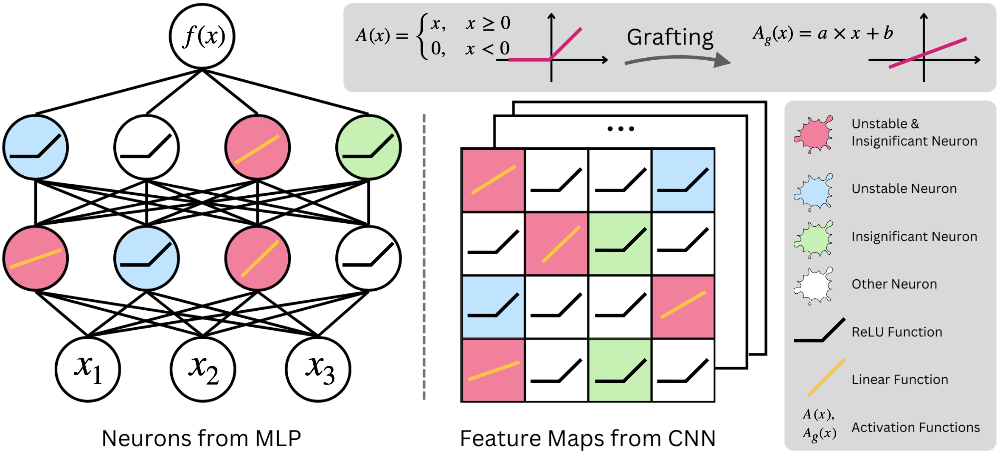

# linearity-grafting-materials

[](https://opensource.org/licenses/MIT)

This repository provides models and code used for the [Bachelor's Thesis](Thesis.pdf) **Formal Verification of Neural Networks using Linearity Grafting** [TUM 2023] by Felix Brandis. 
The code is heavily based on the code provided with the [paper](https://arxiv.org/abs/2206.07839) **Linearity Grafting: Relaxed Neuron Pruning Helps Certifiable Robustness** [ICML 2022] by Tianlong Chen\*, Huan Zhang\*, Zhenyu Zhang, Shiyu Chang, Sijia Liu, Pin-Yu Chen, Zhangyang Wang (\* Equal contribution).
This code in turn is mainly based on the [alpha,beta-CROWN verifier](https://github.com/huanzhang12/alpha-beta-CROWN) with customizations to support linearity grafting. 

In the following an overview of the paper's content and some advice on how to get started with the code to reproduce results.

## Abstract

The increasing deployment of Neural Networks in safety-critical scenarios paired with their black-box nature and the existence of adversarial examples has generated growing academic and industry interest in the robustness of Neural Networks. As an alternative to the cycle of presenting empirical attack and defense strategies, the field of Neural Network Verification has emerged. Due to the complexity of verifying the robustness of a Neural Network, various abstraction and simplification techniques have been proposed. Linearity Grafting as such a technique aims to facilitate verification while preserving the classification performance of a given baseline model by replacing a portion of the nonlinear activation functions with linear approximations. We study the reproducibility of the results reported in the original work introducing Linearity Grafting and find ambiguities in the description of the methods that make the reproduction of results only partially successful. We find that there is a tradeoff between preserving classification performance and enabling a higher verified robustness rate in grafted models. This tradeoff tends to be controllable by the relative weighting of the two graft neuron selection heuristics insignificance and instability. Possible variations in the methods to calculate these heuristics not addressed in the original work cause big differences in the performance of the grafted models. Furthermore, we study a modification of the grafting technique that preserves the weights of the baseline model to evaluate the potential of transferring verification results between the baseline model and the more similar grafted model. This modification does not deliver promising results. We also evaluate the transferability of adversarial examples between baseline and grafted models. The results do not suggest that attacking a model via its grafted counterpart is a promising strategy.
We offer a different interpretation of the originally reported results regarding the potential of Linearity Grafting: A possible explanation for the increased verified robustness and preserved classification accuracy observed in grafted models is a mismatch between problem difficulty and architectural complexity of the baseline model. We speculate that grafted models can only achieve these results if baseline models are overparameterized and unnecessarily complex and hard to verify. We hypothesize that the truly reachable verified robust accuracy depends on problem difficulty and Linearity Grafting only improves the verifiability by aligning model complexity to problem difficulty.


<p>
 
<em>Illustration of Linearity Grafting</em>
</p>

## Code
### Prepare Environment:

```
cd main
conda env create -f environment.yml
conda activate alpha-beta-crown
pip install advertorch
```

### Use Verifier to verify pre-trained models

```
cd main
bash script/verify_pretrained/baseline.sh
bash script/verify_pretrained/graft.sh
```

All models provided (baseline and grafted) can be verified using these scripts to check whether the reported results in the [Thesis](Thesis.pdf) can be reproduced. Adjust parameters (like architecture and model paths) accordingly. Further verification parameters can be adjusted in the configuration files found in the [exp_configs](main/exp_configs/) folder.

### Train and graft own models
```
cd main
# Train
bash script/train.sh # Train a CNN-B on CIFAR-10 by Fast adversarial training with eps=2/255
bash script/verify.sh # verify with Beta-CROWN + branch and bounding on pretrained baseline model
```
The verification process saves information about the instability of neurons (among other things) in the [VERIFY](main/VERIFY/) folder. To create a file containing the instability indicator values per neuron and extract UNR information, use this [notebook](main/notebooks/instability_masks.ipynb). To create a grafting mask, it is additionally necessary to calculate the significance indicator values of the model's neurons. This can be done with the provided script. Adjust model path and significance heuristic accordingly (magnitude, gradient, variance):

```
bash script/calculate_importance_score.sh
```
To combine instability and significance indicator values and perform the neuron selection use the provided [notebook](main/notebooks/mask_creation_cifar_cnnb.ipynb) and save the obtained mask. The following script then can be used to graft a model using the created mask. Adjust parameters (model and mask paths, architecture, etc) accordingly. Verify the obtained model to compare with the baseline.

```
bash script/train_graft.sh # Finetuning with grafting mask
bash script/verify_graft.sh # verify with Beta-CROWN + branch and bounding on Grafted model
```

### Visualisations and Notebooks

The [notebooks](main/notebooks/) folder contains [jupyter notebooks](https://jupyter.org/) that were used to calculate instability indicator values and UNR scores, create grafting masks, perform sanity checks on the trained models, carry out some experiments (like adversarial example transferability) and generate visualizations. They are not perfectly documented, not completely self-explanatory and sometimes more a screenshot of the messy thought- and idea-finding-process :). I am uploading them to make recreating my visualizations easier. Feel free to [email](mailto:felix.brandis@tum.de) me if any questions arise. 

## Other
Detailed citations in the [Thesis](Thesis.pdf).  
[Presentation](Presentation.pdf) of the Thesis in PDF format.
Some useful tutorials to get started on [adversarial robustness](https://adversarial-ml-tutorial.org/) and [NN verification](https://neural-network-verification.com/).


